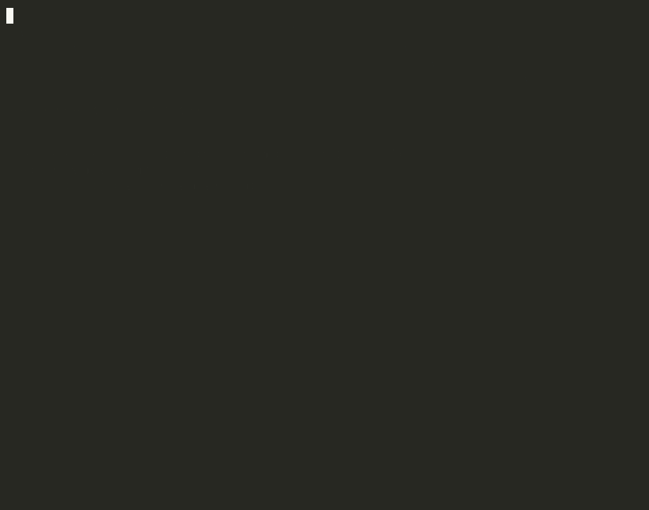
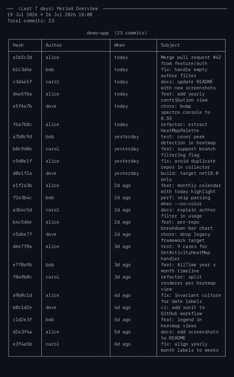
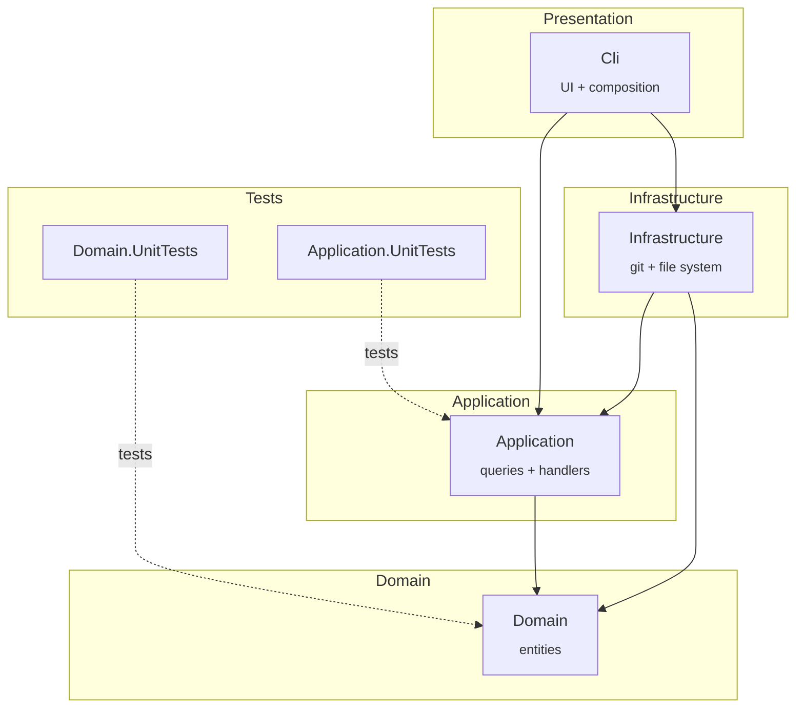

<div align="center">

# CommitLens

A terminal-first Git commit analyser that renders clean reports on activity, rhythm, and contribution patterns.

[](LICENSE)
[](https://dotnet.microsoft.com/download/dotnet/10.0)
[]()



</div>

## What it does

CommitLens scans one or more local directories for Git repositories, then generates visual reports about commit activity. It runs entirely in the terminal — no web server, no browser, no database.

Two reports are available today:

| Report | Answers | Views |
|---|---|---|
| **Period Overview** | *What got committed in the last week/month/year?* | Daily, Weekly, Monthly, Yearly |
| **Activity Heat Map** | *When am I most productive?* | Weekly (day × hour), Monthly (calendar), Yearly (contribution graph), All time (year × month) |

Both support **multi-repository scanning**, **automatic `.git` discovery** inside a folder, and an optional **author filter**.



## Requirements

- [.NET 10 SDK](https://dotnet.microsoft.com/download/dotnet/10.0)
- `git` on your `PATH`

## Installation

```bash
git clone https://github.com/Tllpsm2/Commit-Lens.git
cd Commit-Lens
dotnet run --project CommitLens/src/CommitLens.Cli
```

The first run prompts you for the directories to analyse. That's it — no install, no config files.

## Usage

1. **Collect paths** — enter one or more local directories
2. **Discover repos** — CommitLens finds every sub-directory containing `.git`
3. **Pick a report** — Period Overview or Activity Heat Map
4. **Pick a window** — period/range plus an optional author filter
5. **Scan + render** — `git log` is parsed and rendered with [Spectre.Console](https://github.com/spectreconsole/spectre.console)
6. **Run again** — keep your paths, generate another report

## Architecture



The four layers follow Clean Architecture: the Domain sits at the centre with no external dependencies, Application orchestrates use cases, Infrastructure adapts to the outside world (git CLI, file system), and Cli composes everything and handles user interaction.

## Development

```bash
dotnet build CommitLens.sln
dotnet test CommitLens.sln
```

**43 unit tests** covering the Domain and Application layers (xUnit + FluentAssertions + NSubstitute).

## Roadmap

The current release is a **preview**. The primary objective is to ship CommitLens as a versioned `dotnet tool` on NuGet so it can be installed with `dotnet tool install -g commitlens`.

<details>
<summary><b>Pending reports</b></summary>

- **Top Contributors** — ranking of authors by commit count and participation percentage
- **Bus Factor** — knowledge concentration risk across contributors
- **Ghost Authors** — authors who contributed in the past but have gone inactive
- **Author Activity** — individual developer activity over time

</details>

<details>
<summary><b>Other improvements</b></summary>

- Markdown and JSON export
- `.commitlens.json` configuration file
- Branch filtering
- Remote repository support (clone and analyse from a URL)
- Continuous integration (GitHub Actions)

</details>

## License

MIT © [João Vitor Oliveira Alves](https://github.com/Tllpsm2)
